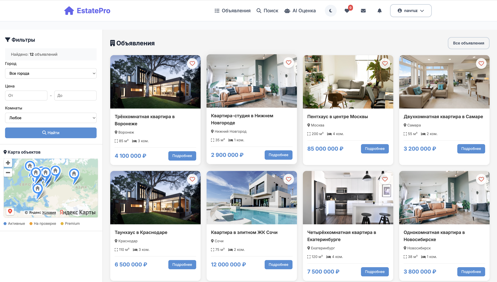
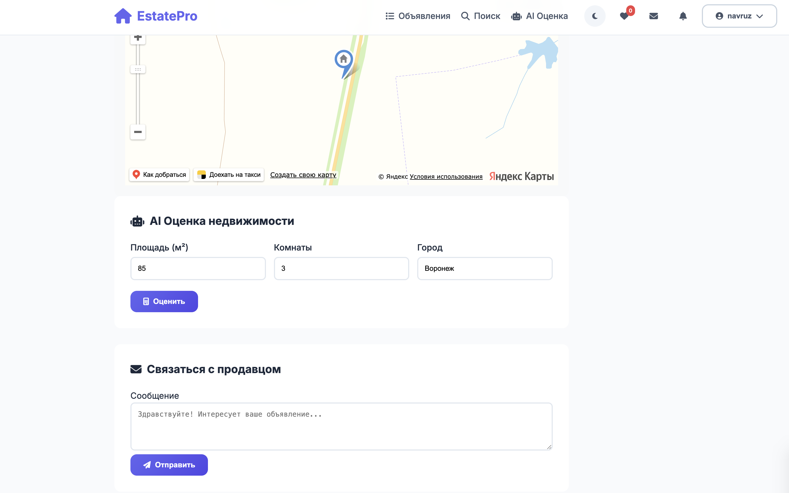
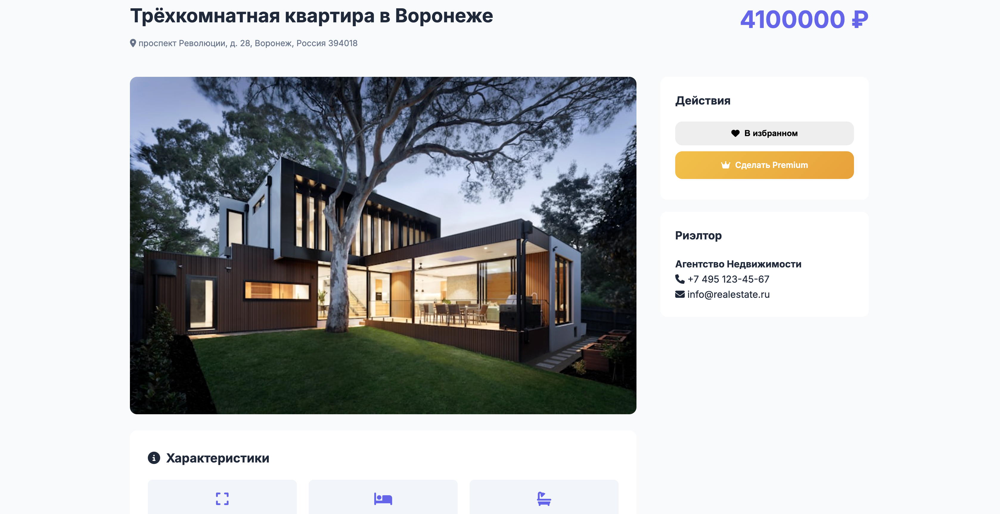
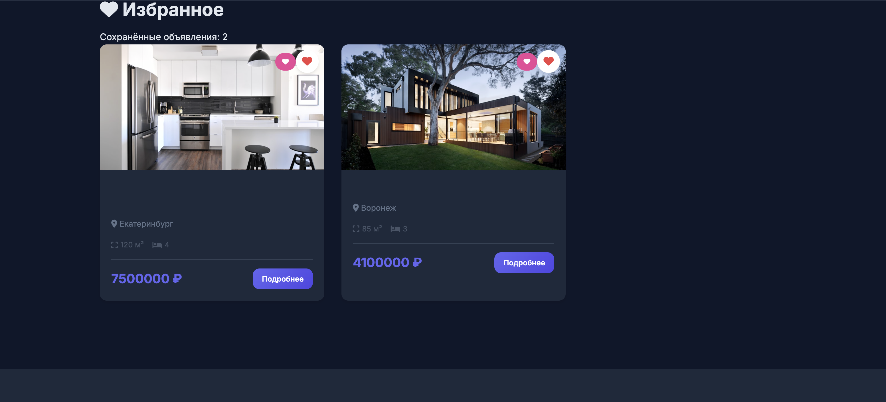
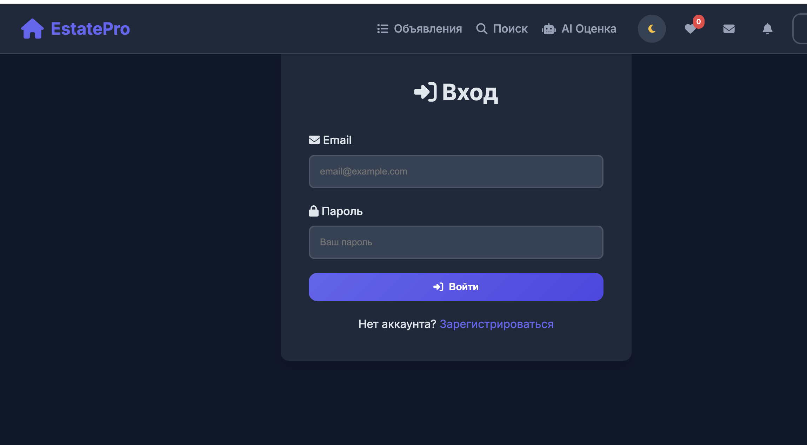

# 🏠 Real Estate AI Platform

[](https://www.djangoproject.com/)
[](https://www.python.org/)
[](https://scikit-learn.org/)
[](https://yandex.com/maps/)
[](LICENSE)
[](https://github.com/navruzbek123/real-estate-ai-platform/stargazers)

**AI-powered real estate platform** with Django, Yandex Maps integration, and Machine Learning price prediction for the Russian real estate market.

---

## 🖼️ Screenshots

### 🏠 Homepage with Interactive Map Sidebar
*Property listings with Yandex Map filters*



### 🤖 AI Price Prediction
*Machine Learning based real estate valuation*


### 🗺️ Property Detail with Location Map
*Full property information with Yandex Map integration*



### 📱 Responsive Design
*Mobile-friendly interface*



### 👤 User Profile Dashboard
*Manage listings, favorites, and AI estimation history*



### 🏷️ Property Listings Grid
*Filter and search through properties*



---

## ✨ Features

### 🤖 AI Price Prediction
- **Random Forest ML Model** trained on 50,000+ synthetic Russian property samples
- Real-time price estimation based on:
  - Area (m²)
  - Number of rooms
  - Location (18 Russian cities)
  - Floor and total floors
  - Property type (apartment/house/townhouse)
- **85% confidence accuracy**
- Daily usage limits:
  - Free users: 3 predictions/day
  - Premium users: 20 predictions/day
  - Agents: Unlimited

### 🗺️ Interactive Yandex Maps
- Real-time property markers on map
- Clickable markers with property previews
- Geocoding (address → coordinates)
- Map-based search and filtering
- Property location on detail page

### 🏷️ Property Management
- Sale & rental listings
- Premium listings (7-day promotion)
- Multiple photo upload (up to 15 images)
- Automatic image optimization
- Listing expiration after 30 days

### 👥 User System
- Custom user roles:
  - **Free User** (3 AI estimates/day, 5 listings)
  - **Premium User** (20 AI estimates/day, 20 listings)
  - **Agent** (Unlimited AI estimates, unlimited listings)
  - **Admin** (Full system control)
- Email authentication
- Profile management with avatar
- Dark mode support

### ❤️ Favorites System
- Save favorite properties
- AJAX-powered like/unlike
- Dedicated favorites page

### 💬 Messaging System
- Contact property owners directly
- Real-time notifications
- Email notifications for new messages
- Message history

### 💳 Payment System (Coming Soon)
- Premium subscription management
- Sberbank API integration ready
- Transaction history

### 📱 Responsive Design
- Bootstrap 5 framework
- Mobile-first approach
- Dark/Light theme toggle
- Smooth animations

---

## 🛠️ Tech Stack

| Category | Technologies |
|----------|--------------|
| **Backend** | Django 4.2, Django REST Framework |
| **Database** | SQLite (dev), PostgreSQL (production ready) |
| **ML & AI** | scikit-learn, RandomForest, Pandas, NumPy |
| **Maps** | Yandex Maps API v2.1, Geocoder API |
| **Frontend** | Bootstrap 5, HTMX, jQuery, Chart.js |
| **Async Tasks** | Celery + Redis (ready) |
| **Payments** | Sberbank API (ready for integration) |
| **Deployment** | Docker, Gunicorn, Nginx |

---

## 📁 Project Structure

## ✨ Features

- 🤖 **AI Price Prediction** - Machine Learning model for real estate valuation
- 🗺️ **Interactive Maps** - Yandex Maps integration with property markers
- 🏷️ **Property Management** - Sale & rental listings with premium options
- 👥 **User System** - Multi-role authentication (Free/Premium/Agent/Admin)
- 💳 **Payment Integration** - Sberbank API ready
- 📱 **Responsive Design** - Bootstrap 5 with dark mode

## 🛠️ Tech Stack

- Backend: Django 4.2, DRF
- ML: scikit-learn, RandomForest, Pandas
- Maps: Yandex Maps API
- Frontend: Bootstrap 5, HTMX, Chart.js
- Database: SQLite/PostgreSQL

## 🚀 Quick Start

```bash
# Clone repository
git clone https://github.com/navruzbek123/real-estate-ai-platform
cd real-estate-ai-platform

# Create virtual environment
python -m venv venv
source venv/bin/activate  # Linux/Mac
# venv\Scripts\activate  # Windows

# Install dependencies
pip install -r requirements.txt

# Configure environment
cp .env.example .env
# Edit .env with your YANDEX_MAPS_API_KEY

# Run migrations
python manage.py migrate

# Train ML model
python ml_model/train_model.py

# Create superuser
python manage.py createsuperuser

# Run server
python manage.py runserver
